# AI-Powered Text Summarizer with Spring AI & Ollama

## Designing a Production-Ready AI Application with Spring Boot, React and Local LLMs

> *This article is the Software Design Document (SDD) for the first project in my Spring AI Projects series. Instead of jumping straight into coding, we'll first design the entire application just like we would in a real software engineering team.*

---

# Introduction

Generative AI is rapidly becoming a standard part of modern software development. As Java developers, we now have an excellent ecosystem in the form of **Spring AI**, which makes it possible to integrate Large Language Models (LLMs) into enterprise applications using familiar Spring programming models.

Unfortunately, most tutorials stop after showing a single REST endpoint that sends a prompt to an LLM and prints the response. While these examples help you understand the API, they don't teach you how to design an AI-powered application that can actually be deployed, maintained, and extended.

This project aims to bridge that gap.

Rather than building another "Hello World" chatbot, we'll design and implement a complete AI application that follows real-world software engineering principles.

By the end of this series, we'll have a production-style application where users can:

* Create AI projects
* Upload and organize documents
* Generate multiple types of summaries
* Continue conversations with AI
* Search previous work
* Switch between different local LLMs
* Extend the application with Retrieval-Augmented Generation (RAG)

The best part is that everything runs locally using **Ollama**, eliminating the need for paid API subscriptions while allowing experimentation with different open-source language models.

---

# Why This Project?

When learning a new framework, the goal shouldn't be to memorize APIs—it should be to understand how to build software.

This project is intentionally designed to expose you to the concepts you'll encounter when developing production AI applications using Spring AI.

Instead of isolated examples, you'll learn how different pieces fit together:

* Frontend interacting with AI services
* Prompt engineering
* Streaming AI responses
* Conversation management
* Data persistence
* Multi-model support
* Document processing
* AI observability
* Production-ready project organization

More importantly, every feature we build will have a practical purpose.

---

# Project Objectives

Our goal is to build an application that is:

* **Practical** — solves a real problem.
* **Production-oriented** — follows good architectural practices.
* **Extensible** — easy to enhance with new AI capabilities.
* **Open Source** — runs completely on local LLMs.
* **Educational** — covers the latest Spring AI features through implementation.

Rather than creating multiple disconnected demos, we'll continue enhancing the same application throughout the series.

---

# What Are We Building?

At its core, the application helps users organize AI-powered work inside **Projects**.

Instead of generating summaries in isolation, every interaction belongs to a project.

For example:

```text
Spring AI Learning
│
├── Uploaded Documents
├── Generated Summaries
├── AI Conversations
├── Project Settings
└── History
```

Another project might look like:

```text
System Design Interview Preparation
│
├── Distributed Systems.pdf
├── Notes
├── Executive Summary
├── Interview Questions
└── AI Discussions
```

This approach closely resembles how modern AI tools organize user data and makes the application much easier to extend in future parts.

---

# Why Projects Instead of Just Summaries?

Many beginner AI applications store summaries independently.

While that works for small demos, it quickly becomes difficult to organize information as users generate more AI content.

Instead, our application follows this hierarchy:

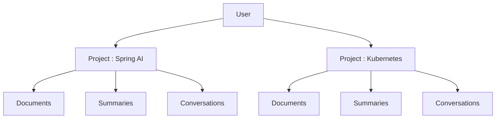

This design provides several benefits:

* Better organization
* Easier searching
* Reusable conversations
* Document grouping
* Simpler RAG implementation
* Future collaboration support

---

# Guest User Experience

Authentication is important, but implementing login should not block learning AI concepts.

Instead, we'll start with a lightweight **Guest User** mechanism.

On the first visit:

1. React generates a unique identifier.
2. The identifier is stored in Local Storage.
3. Backend creates a Guest User automatically.
4. Every request includes this identifier.

The user never has to sign in, but their projects and history remain available on subsequent visits from the same browser.

Later in the series, this mechanism can be seamlessly replaced with JWT or OAuth authentication without changing the application's core architecture.

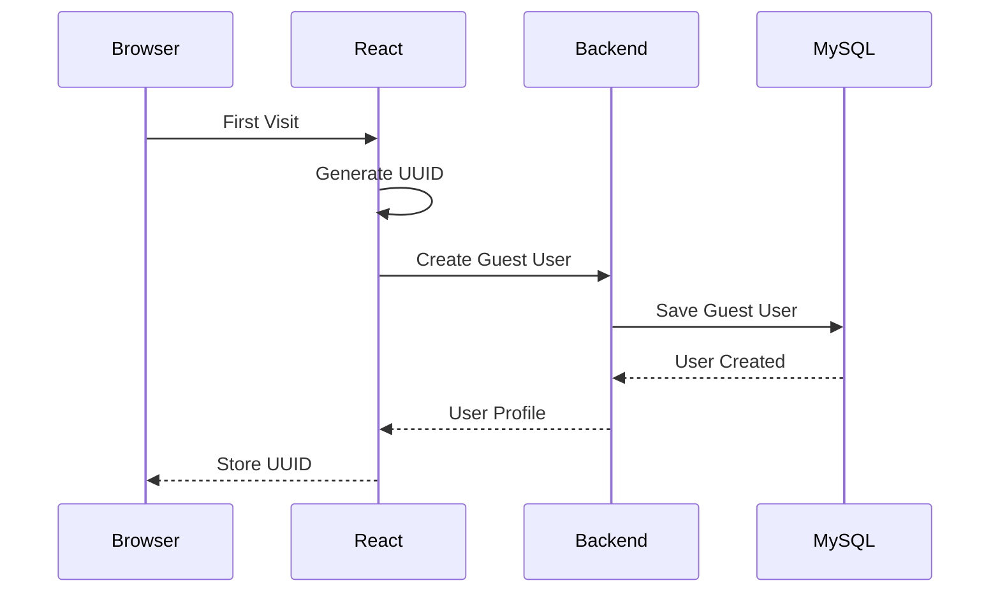

---

# Key Features

By the end of the series, the application will support:

### Project Management

* Create projects
* Rename projects
* Delete projects
* Browse project history

### AI Text Summarization

* Short summaries
* Detailed summaries
* Executive summaries
* Bullet-point summaries
* Technical summaries

### Document Management

* Upload PDF
* Upload DOCX
* Upload TXT
* View uploaded documents

### AI Conversations

* Continue chatting after generating summaries
* Ask follow-up questions
* Explain concepts
* Generate quizzes
* Translate responses

### Multi-Model Support

Users can switch between locally running models such as:

* Mistral
* Llama 3
* Qwen

without changing application code.

### History

Every AI interaction is automatically saved.

Users can revisit:

* prompts
* summaries
* conversations
* uploaded documents

---

# Technology Stack

## Backend

* Java 21
* Spring Boot
* Spring AI
* Spring Data JPA
* MySQL
* Gradle

## AI

* Ollama
* Mistral
* Llama 3
* Qwen

## Frontend

* React
* Tailwind CSS
* Axios
* React Router
* React Markdown

---

# High-Level Architecture

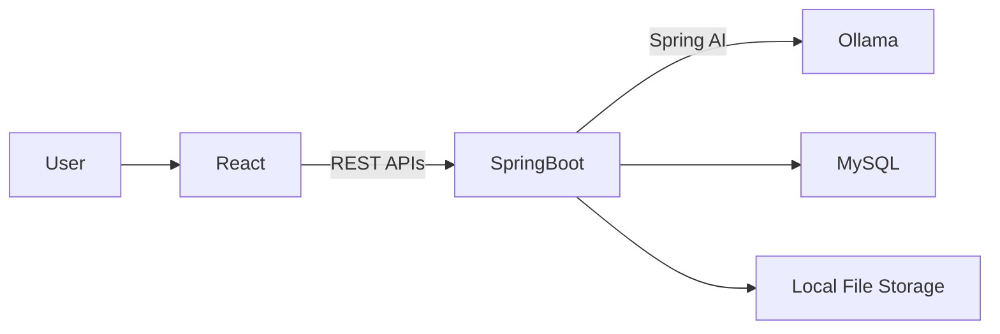

Each layer has a clearly defined responsibility.

### React

Responsible for:

* User interface
* Project management
* AI chat interface
* Document uploads
* Summary rendering

### Spring Boot

Responsible for:

* Business logic
* REST APIs
* Prompt construction
* AI orchestration
* Persistence
* Validation

### Spring AI

Responsible for:

* Communication with Ollama
* Prompt templates
* Streaming responses
* Structured outputs
* Chat memory
* Embedding generation (later)

### Ollama

Responsible for:

* Running open-source LLMs locally
* Processing prompts
* Generating responses

### MySQL

Responsible for storing:

* Users
* Projects
* Documents
* Summaries
* Conversations

---

# End-to-End Request Flow

The following diagram illustrates how a summary request travels through the system.

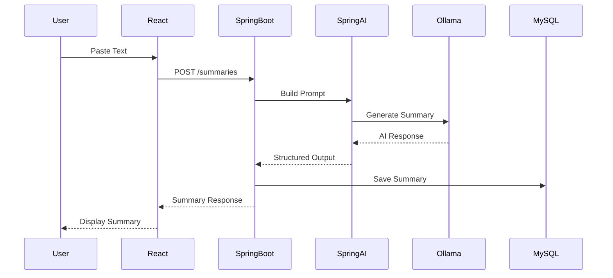

---

# Project Workflow

The overall application workflow is intentionally designed to be simple for users while remaining flexible for future enhancements.

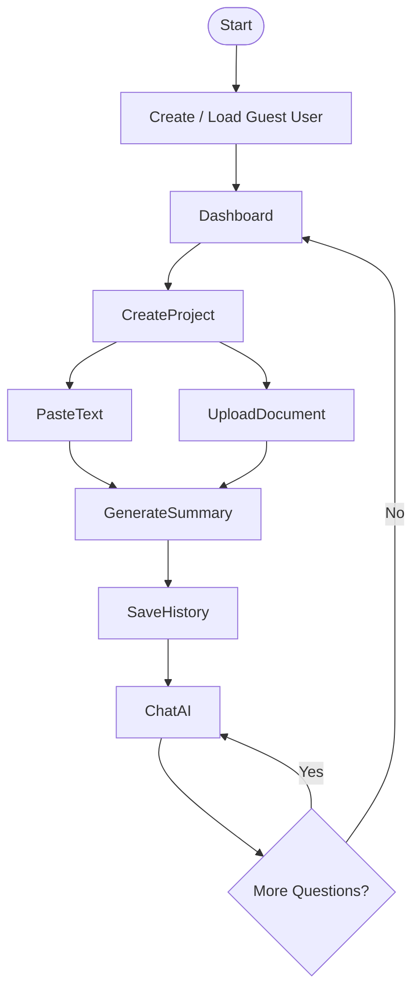

---

# Series Roadmap

To keep the implementation focused, this project will be built across three parts.

## Part 1 — AI Text Summarizer

We'll build the core application capable of generating AI-powered summaries, persisting history, supporting guest users, and managing projects.

## Part 2 — Document Intelligence

We'll introduce document uploads, Retrieval-Augmented Generation (RAG), embeddings, vector search, and AI conversations over uploaded documents.

## Part 3 — Production Readiness

Finally, we'll enhance the application with multi-model support, caching, observability, guardrails, and deployment using Docker Compose.

---

# What's Next?

Now that we've defined the vision, architecture, and user workflow, the next article will dive into the application's internal design.

We'll design:

* the complete MySQL database schema,
* frontend pages and navigation,
* reusable React components,
* backend package structure,
* service layer organization,
* and the REST API contract that will power the application.

By the end of the next part, we'll have a complete blueprint ready for implementation before writing a single line of business logic.

# Part B — Database Design, Frontend Architecture & Backend Design

In the previous article, we defined the vision, architecture, and overall workflow of our AI-powered application.

Now it's time to design the internal structure of the system before we begin implementation.

This article focuses on three major areas:

* Designing a scalable MySQL database
* Planning the frontend pages and user experience
* Organizing the Spring Boot backend for long-term maintainability

Although the application starts as an AI Text Summarizer, every design decision is made with future enhancements like **RAG**, **AI Agents**, **Tool Calling**, and **MCP** in mind.

---

# Database Design Principles

Before creating tables, let's establish a few design principles.

### 1. Every resource belongs to a User

Initially, we'll use Guest Users.

Later, Guest Users can seamlessly become authenticated users without changing the database schema.

---

### 2. Everything belongs to a Project

Instead of storing summaries independently, every document, conversation, and summary belongs to a project.

This allows users to organize their AI work naturally.

---

### 3. AI interactions should be auditable

Every AI request stores:

* Prompt
* Model
* Response
* Tokens
* Processing Time

This will later help us build analytics and observability dashboards.

---

# Database Overview

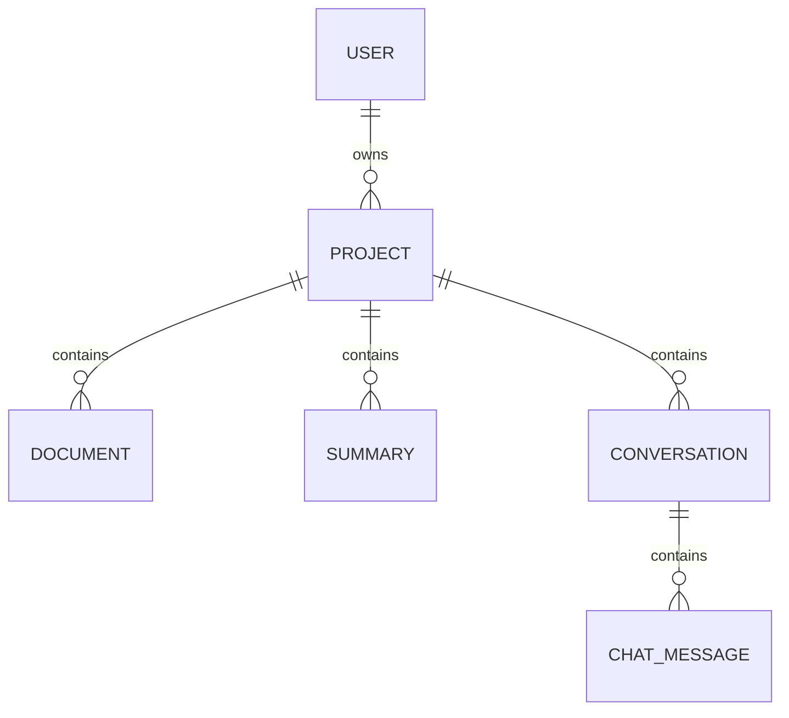

---

# User Table

The application starts with Guest Users.

Later, authentication can simply update existing users instead of migrating data.

| Column                 | Type     |
| ---------------------- | -------- |
| id                     | BIGINT   |
| public_id              | UUID     |
| display_name           | VARCHAR  |
| guest_user             | BOOLEAN  |
| preferred_model        | VARCHAR  |
| preferred_summary_type | VARCHAR  |
| created_at             | DATETIME |
| last_active_at         | DATETIME |

---

# Project Table

Projects are the heart of the application.

Everything the user creates belongs here.

| Column        | Type     |
| ------------- | -------- |
| id            | BIGINT   |
| user_id       | FK       |
| name          | VARCHAR  |
| description   | TEXT     |
| default_model | VARCHAR  |
| created_at    | DATETIME |
| updated_at    | DATETIME |

Example

```text
Project

Spring AI Learning

├── SpringAI.pdf

├── Summary

├── Chat

└── Notes
```

---

# Document Table

Stores uploaded files.

| Column         | Type     |
| -------------- | -------- |
| id             | BIGINT   |
| project_id     | FK       |
| file_name      | VARCHAR  |
| file_type      | VARCHAR  |
| file_size      | BIGINT   |
| storage_path   | VARCHAR  |
| extracted_text | LONGTEXT |
| upload_time    | DATETIME |

Initially we'll support

* PDF
* DOCX
* TXT

Future versions can add

* Markdown
* HTML
* Images
* Audio

---

# Summary Table

Stores every generated summary.

| Column           | Type     |
| ---------------- | -------- |
| id               | BIGINT   |
| project_id       | FK       |
| original_text    | LONGTEXT |
| summary          | LONGTEXT |
| summary_type     | VARCHAR  |
| model            | VARCHAR  |
| input_tokens     | INT      |
| output_tokens    | INT      |
| response_time_ms | INT      |
| created_at       | DATETIME |

Why store token usage?

Because later we'll build dashboards showing

* Total AI requests
* Average response time
* Average token usage
* Model comparison

---

# Conversation Table

Each project can have multiple AI conversations.

| Column     | Type     |
| ---------- | -------- |
| id         | BIGINT   |
| project_id | FK       |
| title      | VARCHAR  |
| model      | VARCHAR  |
| created_at | DATETIME |

---

# Chat Message Table

Stores conversation history.

| Column            | Type             |
| ----------------- | ---------------- |
| id                | BIGINT           |
| conversation_id   | FK               |
| role              | USER / ASSISTANT |
| message           | LONGTEXT         |
| prompt_tokens     | INT              |
| completion_tokens | INT              |
| created_at        | DATETIME         |

---

# Complete Database Model

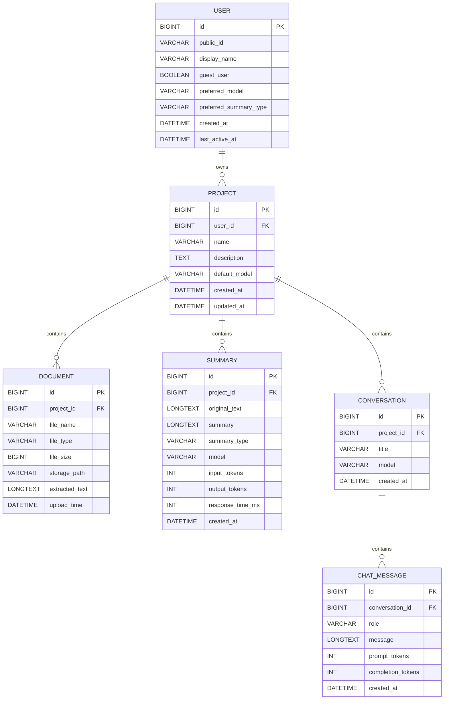

---

# Frontend Design

Instead of creating numerous pages, we'll keep the application simple and intuitive.

---

# Navigation

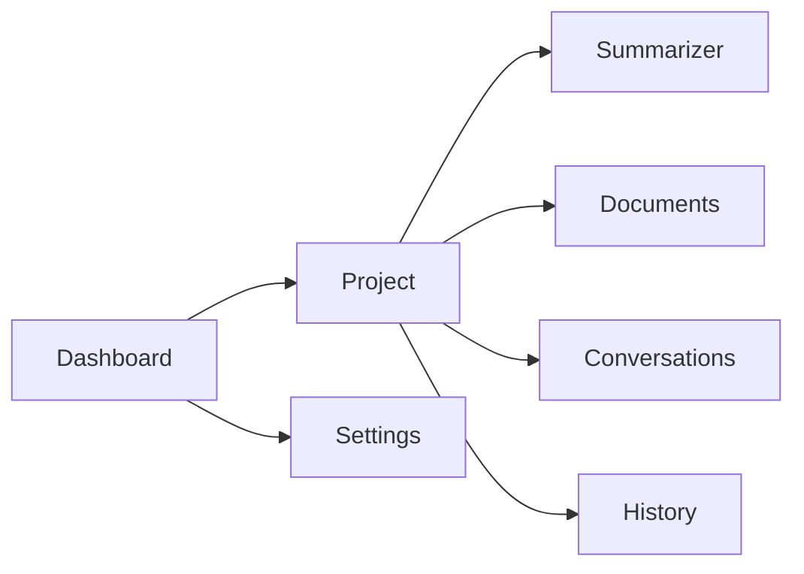

---

# Dashboard

The landing page after the Guest User is created.

Displays

* Recent Projects
* Create New Project
* Recently Generated Summaries
* Recently Uploaded Documents

Actions

* Create Project
* Open Project
* Delete Project

---

# Project Workspace

Everything related to one project lives here.

```text
------------------------------------------------

Project Name

------------------------------------------------

Tabs

Summary

Documents

Chat

History

------------------------------------------------
```

This page becomes the primary workspace.

---

# Summary Tab

The core feature of Part 1.

Features

* Large text editor
* Summary Type selector
* Model selector
* Generate button
* Streaming response
* Markdown rendering
* Copy summary
* Regenerate summary

Summary Types

* Short
* Detailed
* Executive
* Bullet Points

---

# Documents Tab

Introduced in Part 2.

Features

* Upload document
* Document list
* Delete
* View details
* Generate summary

---

# AI Chat Tab

Allows users to continue the conversation.

Example

```text
You

Explain this summary.

AI

Here's a simplified explanation...
```

Suggested prompts

* Explain further
* Translate
* Create quiz
* Generate interview questions

---

# History Tab

Displays all AI activities within the project.

Filters

* Model
* Summary Type
* Date

Actions

* View
* Copy
* Delete

---

# Settings Page

User preferences.

Configuration

* Preferred Model
* Default Summary Type
* Streaming Enabled

These preferences are stored in the User table.

---

# React Component Structure

```text
src

components

├── Navbar

├── Sidebar

├── SummaryEditor

├── SummaryViewer

├── DocumentUploader

├── DocumentTable

├── ChatWindow

├── ChatInput

├── MarkdownViewer

├── ModelSelector

├── SummaryTypeSelector

├── LoadingIndicator

├── StreamingMessage

└── ConfirmationDialog
```

These components are reusable across multiple pages.

---

# Backend Design

Our backend follows a standard layered architecture with a dedicated AI module to keep Spring AI-specific logic isolated from the rest of the application.

```text
Client

↓

Controller

↓

Service

↓

Repository

↓

MySQL

↓

Spring AI Module

↓

Ollama
```

---

# Package Structure

```text
com.codefarm.ai

├── config

├── common

├── controller

├── dto

├── entity

├── repository

├── service

├── mapper

├── exception

├── validation

├── ai

│     ├── prompt

│     ├── advisor

│     ├── client

│     ├── parser

│     ├── model

│     └── util

└── util
```

---

# Module Responsibilities

## User Module

Responsible for

* Guest user creation
* User preferences
* Activity tracking

---

## Project Module

Responsible for

* Project CRUD
* Project validation
* Project ownership

---

## Summary Module

Responsible for

* Summary generation
* Prompt construction
* Summary persistence
* Streaming responses

---

## Document Module

Responsible for

* Uploading files
* Extracting text
* File management

---

## Conversation Module

Responsible for

* Chat history
* AI conversations
* Conversation titles

---

## AI Module

This is the heart of the application.

Responsibilities include:

* ChatClient configuration
* Prompt templates
* Structured outputs
* Streaming
* Model switching
* Spring AI integration

Keeping AI-specific logic isolated makes it easier to adopt new Spring AI features in the future.

---

# Request Processing Flow

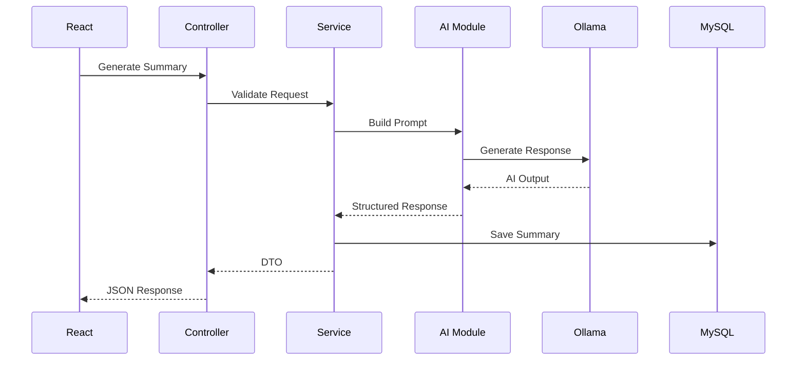

---

# Preparing for Future Enhancements

Although the first implementation focuses on text summarization, this architecture is intentionally designed to support future capabilities without major refactoring.

The current design leaves room for:

* Retrieval-Augmented Generation (RAG)
* Vector databases
* AI Agents
* Tool Calling
* Model Context Protocol (MCP)
* Authentication with JWT or OAuth
* Multi-user collaboration
* AI analytics and observability
* Prompt versioning
* Model comparison
* Redis caching

Because we have separated responsibilities into well-defined modules and centered the application around **Projects**, each new capability can be introduced incrementally while keeping the codebase clean and maintainable.

---

## What's Next?

With the application's internal structure now fully designed, the next part of this series will focus on the **REST API contract and implementation roadmap**.

We'll define every endpoint, request and response model, error handling strategy, pagination approach, and the three implementation phases that will guide the development of the entire application. This API-first approach ensures both the React frontend and Spring Boot backend can evolve independently while maintaining a well-defined contract.


# Part C — REST API Design & Implementation Roadmap

## Designing a Scalable API Contract for Our Spring AI Application

In the previous article, we designed the database schema, frontend architecture, and backend modules. Before writing any business logic, one final design step remains—defining the API contract.

A well-designed REST API acts as a contract between the frontend and backend. It allows both teams to work independently while ensuring consistent communication. More importantly, it forces us to think through user workflows, resource ownership, pagination, validation, and error handling before implementation begins.

Since our application is organized around **Users → Projects → AI Resources**, the APIs follow the same hierarchy.

---

# API Design Principles

Throughout the project, we'll follow these principles:

* RESTful resource naming
* Stateless APIs
* Versioned endpoints (`/api/v1`)
* Pagination for list APIs
* Consistent response structure
* Proper HTTP status codes
* Streaming support for AI responses
* User context via request headers

---

# Authentication Strategy

Initially, the application supports **Guest Users**.

The frontend stores the generated `publicId` in Local Storage and sends it with every request.

```http
X-User-Id: 71a18a6c-73cf-4d63-a667-7d26dbe4a53b
```

Later, when JWT authentication is introduced, this header can simply be replaced with the authenticated user's identity without changing any API contracts.

---

# Standard Response Format

Every successful API should follow a consistent structure.

```json
{
  "success": true,
  "data": {},
  "timestamp": "2026-07-07T12:30:15"
}
```

Error responses should also remain consistent.

```json
{
  "success": false,
  "message": "Project not found",
  "errorCode": "PROJECT_NOT_FOUND",
  "timestamp": "2026-07-07T12:30:15"
}
```

---

# User APIs

## Create Guest User

```http
POST /api/v1/users/guest
```

Response

```json
{
  "publicId": "71a18a6c-73cf-4d63-a667-7d26dbe4a53b",
  "displayName": "Guest-2048"
}
```

---

## Get User Profile

```http
GET /api/v1/users/me
```

---

## Update User Preferences

```http
PUT /api/v1/users/preferences
```

```json
{
  "preferredModel": "llama3",
  "preferredSummaryType": "DETAILED"
}
```

---

# Project APIs

Projects are the primary resource in our application.

---

## Create Project

```http
POST /api/v1/projects
```

Request

```json
{
  "name": "Spring AI Learning",
  "description": "Learning Spring AI"
}
```

Response

```json
{
  "id": 12,
  "name": "Spring AI Learning"
}
```

---

## Get Projects

```http
GET /api/v1/projects?page=0&size=10
```

---

## Project Details

```http
GET /api/v1/projects/{projectId}
```

---

## Update Project

```http
PUT /api/v1/projects/{projectId}
```

---

## Delete Project

```http
DELETE /api/v1/projects/{projectId}
```

---

# Summary APIs

These APIs power the core feature of Part 1.

---

## Generate Summary

```http
POST /api/v1/projects/{projectId}/summaries
```

Request

```json
{
  "text": "...",
  "summaryType": "EXECUTIVE",
  "model": "mistral"
}
```

Response

```json
{
  "summaryId": 45,
  "summary": "...",
  "model": "mistral",
  "inputTokens": 1820,
  "outputTokens": 210,
  "responseTime": 1430
}
```

---

## Stream Summary

```http
GET /api/v1/projects/{projectId}/summaries/stream
```

Content-Type

```
text/event-stream
```

Example

```
data: Artificial

data: Intelligence

data: is

data: transforming...
```

---

## List Summaries

```http
GET /api/v1/projects/{projectId}/summaries?page=0&size=10
```

Filters

* summaryType
* model
* date

---

## Summary Details

```http
GET /api/v1/projects/{projectId}/summaries/{summaryId}
```

---

## Delete Summary

```http
DELETE /api/v1/projects/{projectId}/summaries/{summaryId}
```

---

# Document APIs

Implemented in Part 2.

---

## Upload Document

```http
POST /api/v1/projects/{projectId}/documents
```

Multipart Request

```
file
```

Response

```json
{
  "documentId": 19,
  "fileName": "spring-ai.pdf"
}
```

---

## List Documents

```http
GET /api/v1/projects/{projectId}/documents
```

---

## Document Details

```http
GET /api/v1/projects/{projectId}/documents/{documentId}
```

---

## Delete Document

```http
DELETE /api/v1/projects/{projectId}/documents/{documentId}
```

---

## Generate Document Summary

```http
POST /api/v1/projects/{projectId}/documents/{documentId}/summaries
```

---

# Conversation APIs

---

## Create Conversation

```http
POST /api/v1/projects/{projectId}/conversations
```

---

## Chat with AI

```http
POST /api/v1/projects/{projectId}/conversations/{conversationId}/messages
```

Request

```json
{
  "message": "Explain this summary in simple words."
}
```

---

## Conversation History

```http
GET /api/v1/projects/{projectId}/conversations/{conversationId}
```

---

## Delete Conversation

```http
DELETE /api/v1/projects/{projectId}/conversations/{conversationId}
```

---

# AI Model APIs

These APIs make the frontend independent of hardcoded model names.

---

## Available Models

```http
GET /api/v1/models
```

Response

```json
[
  "mistral",
  "llama3",
  "qwen"
]
```

---

## Health Check

Useful for verifying Ollama connectivity.

```http
GET /api/v1/models/status
```

Example

```json
{
  "model":"mistral",
  "status":"ONLINE"
}
```

---

# API Workflow

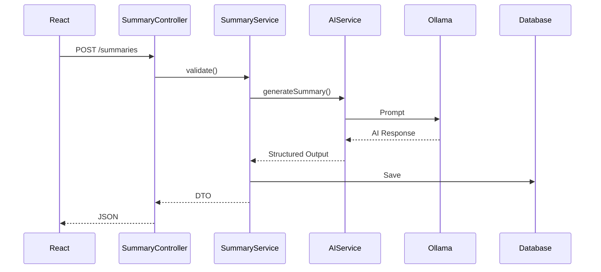

---

# Validation Rules

## Project

* Name required
* Maximum 100 characters

---

## Summary

* Text required
* Maximum input size configurable
* Valid summary type
* Supported AI model

---

## Documents

* Maximum upload size
* Allowed file types
* Duplicate file detection

---

# Pagination Strategy

Every collection endpoint supports pagination.

Example

```
GET /projects?page=0&size=20
```

Standard Response

```json
{
  "content": [],
  "page": 0,
  "size": 20,
  "totalElements": 84,
  "totalPages": 5
}
```

---

# HTTP Status Codes

| Code | Meaning               |
| ---- | --------------------- |
| 200  | Success               |
| 201  | Created               |
| 204  | Deleted               |
| 400  | Validation Error      |
| 401  | Unauthorized (future) |
| 403  | Forbidden             |
| 404  | Not Found             |
| 409  | Conflict              |
| 500  | Internal Server Error |

---

# Exception Handling

We'll implement a centralized `GlobalExceptionHandler`.

Common exceptions include:

* ProjectNotFoundException
* SummaryNotFoundException
* DocumentNotFoundException
* InvalidModelException
* FileUploadException
* AIProcessingException
* ValidationException

This ensures every API returns a predictable error format.

---

# Three-Part Implementation Roadmap

Instead of introducing isolated demos, we'll continuously evolve the same application.

## Part 1 — AI Text Summarizer

The first implementation focuses on building a complete, usable AI application.

### Backend

* Spring Boot project setup
* Spring AI integration with Ollama
* Guest User support
* Project CRUD
* Summary generation
* Prompt Templates
* Streaming responses
* Summary persistence in MySQL
* Global exception handling
* Validation
* Pagination

### Frontend

* Dashboard
* Project Workspace
* Summary page
* Markdown rendering
* Streaming UI
* Project management
* History page

By the end of Part 1, users can create projects, generate summaries using local LLMs, and revisit previous AI interactions.

---

## Part 2 — Document Intelligence

The second phase transforms the summarizer into a document intelligence platform.

### Backend

* PDF, DOCX, and TXT upload
* Spring AI Document Readers
* Embedding generation
* Vector Store integration
* Retrieval-Augmented Generation (RAG)
* Conversation management
* Chat history

### Frontend

* Document upload
* Document library
* Chat interface
* Ask questions about uploaded documents
* Citation-aware responses

---

## Part 3 — Production Readiness

The final phase focuses on operational excellence and extensibility.

### Backend

* Multi-model support
* Model switching
* AI Guardrails
* Redis caching
* Micrometer metrics
* Spring Boot Actuator
* Docker Compose
* Configuration profiles

### Frontend

* AI settings
* Model selector
* Response metrics
* Token usage dashboard
* Performance insights

This phase prepares the application for real-world deployment and introduces many of the production patterns used in enterprise AI systems.

---

# Folder Structure

By the end of the series, the repository will be organized as follows:

```text
ai-text-summarizer

├── backend
│   ├── src
│   ├── docker
│   └── README.md
│
├── frontend
│   ├── src
│   ├── public
│   └── README.md
│
├── docs
│   ├── architecture.md
│   ├── api-contract.md
│   ├── diagrams
│   └── screenshots
│
├── docker-compose.yml
└── README.md
```

This structure keeps implementation, documentation, and deployment assets clearly separated.

---

# What's Next?

With the system architecture, database design, frontend planning, backend organization, and REST APIs now fully defined, we have a complete blueprint for implementation.

In the final article of this design series, we'll look at the **Spring AI features we'll be using**, discuss the project structure in more detail, highlight production best practices, and compile a curated list of official documentation and resources that will serve as references throughout the implementation journey.

# Part D — Spring AI Features, Development Guidelines & Implementation References

## Preparing to Build a Production-Ready AI Application with Spring AI

In the previous three articles, we've completed the software design of our AI-powered application. We now have a clear understanding of the system architecture, database design, frontend pages, backend modules, and REST API contracts.

The final piece before we start coding is understanding **which Spring AI features we'll use**, **why we're using them**, and **where to find the official documentation** during implementation.

The goal of this series isn't just to build a working application—it's to learn how Spring AI is used to build production-grade AI systems.

---

# What We'll Learn Throughout This Series

Our application has been intentionally designed so that every major feature introduces a new Spring AI capability.

Instead of learning APIs in isolation, we'll apply them to solve real problems.

| Feature                | Spring AI Capability |
| ---------------------- | -------------------- |
| Generate summaries     | ChatClient           |
| Dynamic prompts        | Prompt Templates     |
| Streaming UI           | Streaming Responses  |
| JSON output            | Structured Output    |
| Continue conversations | Chat Memory          |
| Upload documents       | Document Readers     |
| Chat with documents    | RAG                  |
| Semantic Search        | Embeddings           |
| Knowledge Retrieval    | Vector Store         |
| Multiple AI Models     | Model Abstraction    |
| Prompt Security        | Advisors             |
| AI Metrics             | Observability        |

By the end of the project, you'll have hands-on experience with most of the features available in the current Spring AI ecosystem.

---

# Spring AI Features We'll Implement

## 1. ChatClient

Every AI request in our application will go through Spring AI's `ChatClient`.

We'll use it for:

* Text summarization
* Question answering
* Document chat
* AI conversations
* Follow-up prompts

Instead of interacting directly with Ollama, our business layer will communicate with Spring AI.

```text
Controller

↓

Summary Service

↓

ChatClient

↓

Ollama
```

This abstraction allows us to change models without rewriting business logic.

---

# 2. Prompt Templates

Hardcoding prompts quickly becomes difficult to maintain.

Instead, we'll create reusable templates.

Example

```text
Summarize the following text.

Summary Type:
{summaryType}

Content:
{text}
```

Advantages

* Reusable
* Easy to modify
* Cleaner code
* Easier testing

---

# 3. Streaming Responses

Instead of waiting several seconds for the entire response, users should see content appear gradually.

Similar to ChatGPT.

```
Generating Summary...

Artificial Intelligence

is transforming

software development...
```

Benefits

* Better user experience
* Perceived faster performance
* Responsive UI

---

# 4. Structured Output

Instead of asking the AI to return plain text, we'll request structured JSON that can be mapped directly into Java objects.

Example

```json
{
  "title": "...",
  "summary": "...",
  "keywords": [
    "...",
    "..."
  ]
}
```

This makes AI responses much easier to consume from the frontend.

---

# 5. Chat Memory

Once a summary is generated, users should be able to continue the conversation naturally.

Example

```
Generate Summary

↓

Explain this

↓

Give Examples

↓

Translate

↓

Generate Quiz
```

Without conversation memory, every request would need the full context again.

---

# 6. Document Readers

In Part 2, users will upload documents instead of manually pasting text.

Supported formats

* PDF
* DOCX
* TXT

Spring AI provides document readers that simplify content extraction and prepare documents for further processing.

---

# 7. Embedding Models

Summarizing documents is useful.

Searching across large documents is even more useful.

To achieve this, we'll generate embeddings for uploaded content.

Embeddings convert text into numerical vectors that capture semantic meaning rather than exact words.

This enables searches based on intent instead of simple keyword matching.

---

# 8. Vector Store

Once embeddings are generated, they need to be stored efficiently.

In Part 2, we'll integrate a vector store that supports similarity search.

Typical workflow:

```
Upload Document

↓

Extract Text

↓

Split into Chunks

↓

Generate Embeddings

↓

Store in Vector Database

↓

Retrieve Relevant Chunks

↓

Send Context to AI
```

This forms the foundation of Retrieval-Augmented Generation (RAG).

---

# 9. Advisors

Advisors allow us to modify AI requests before they reach the language model.

Examples include:

* Injecting project context
* Adding conversation history
* Retrieving document content
* Applying guardrails

As the project evolves, Advisors will become one of the most powerful extension points in our AI pipeline.

---

# 10. Model Abstraction

Our application should never depend on a single model.

Users will be able to switch between locally running models such as:

* Mistral
* Llama 3
* Qwen

without changing application code.

This flexibility also makes it easy to compare response quality and performance.

---

# Application Evolution

The application grows gradually throughout the series.

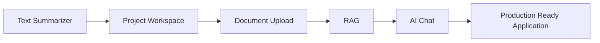

Each stage introduces a meaningful feature while reinforcing Spring AI concepts.

---

# Development Best Practices

To keep the codebase maintainable, we'll follow a few engineering principles throughout the series.

## Keep AI Logic Isolated

Only the AI module should communicate directly with Spring AI.

Business services should never build prompts themselves.

---

## Keep Prompts Versioned

Prompt templates should live in dedicated files or classes.

Avoid scattering prompt strings throughout the codebase.

---

## Prefer Configuration Over Hardcoding

Model names, temperatures, and AI settings should be configurable through application properties rather than embedded in code.

---

## Design for Extensibility

The architecture should make it easy to add:

* New AI models
* New prompt templates
* New document types
* New summary formats

without changing existing business logic.

---

## Store AI Metadata

Every AI interaction should capture metadata such as:

* Model
* Prompt
* Response time
* Token usage
* Timestamp

This information becomes valuable for debugging, analytics, and future observability features.

---

# Project Repository Structure

By the end of the series, the repository will look like this:

```text
ai-text-summarizer

├── backend
│   ├── src
│   ├── docker
│   ├── prompts
│   └── README.md
│
├── frontend
│   ├── src
│   ├── public
│   └── README.md
│
├── docs
│   ├── architecture.md
│   ├── api-contract.md
│   ├── setup.md
│   ├── diagrams
│   └── screenshots
│
├── docker-compose.yml
├── .gitignore
└── README.md
```

This structure separates implementation, documentation, and deployment resources while keeping the project easy to navigate.

---

# Development Workflow

The implementation will follow a simple, iterative workflow.

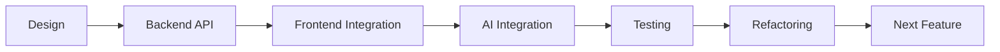

Each iteration results in a working application before moving to the next feature.

---

# Official References

The following resources will be the primary references throughout this series.

## Spring AI

* Spring AI Reference Documentation
* Spring AI GitHub Repository
* Spring AI Samples

---

## Spring Boot

* Spring Boot Reference Documentation
* Spring Web Documentation
* Spring Data JPA Documentation
* Spring Validation Documentation

---

## Ollama

* Ollama Documentation
* Ollama Model Library

---

## AI Models

* Mistral AI Documentation
* Meta Llama Documentation
* Qwen Documentation

---

## Database

* MySQL Documentation

---

## Frontend

* React Documentation
* React Router Documentation
* Tailwind CSS Documentation
* React Markdown Documentation

---

## Build & Deployment

* Gradle User Guide
* Docker Documentation
* Docker Compose Documentation

---

## API Testing

* Bruno
* Postman

---

## Future Topics

After completing this project, you'll have a solid foundation to explore more advanced AI application patterns.

Some natural extensions include:

* AI Agents
* Model Context Protocol (MCP)
* Tool Calling
* Multi-Agent Workflows
* AI Evaluation
* Guardrails
* AI Observability
* Hybrid Search
* Enterprise RAG
* Multi-modal AI
* Voice Interfaces

These topics build naturally on the architecture we've designed here.

---

# Conclusion

With this article, we've completed the design phase of our first Spring AI project.

Before writing any code, we've defined:

* A scalable application architecture
* A normalized database design
* An intuitive frontend experience
* A modular Spring Boot backend
* A complete REST API contract
* A phased implementation roadmap
* The Spring AI features we'll learn
* The development practices we'll follow
* The official references that will guide implementation

This mirrors how software is designed in professional engineering teams—starting with architecture and clear contracts before implementation begins.

In the next article, we'll finally move from design to code. We'll bootstrap the Spring Boot and React applications, configure Ollama and Spring AI, create our first Guest User, and generate the first AI-powered summary. From there, we'll continue evolving the application feature by feature until it becomes a production-ready AI platform powered entirely by open-source models.

